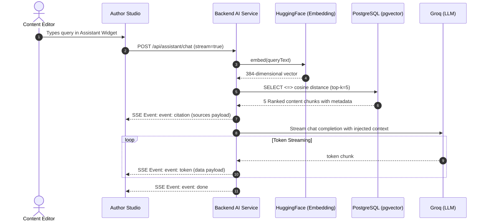
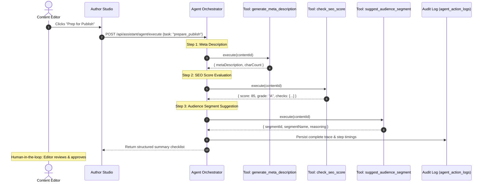

# AI Pipeline & RAG Architecture

## End-to-End RAG Sequence

## Agentic "Prep for Publish" Sequence

## Chunking Strategy

To prevent semantic dilution and context fragmentation, ContentPilot AI uses a recursive token-aware chunking strategy:

1. **Paragraph Splits**: Split along double-newline boundaries (`\n\n`).
2. **Line Splits**: Split along single-newline boundaries (`\n`).
3. **Sentence Splits**: Split along punctuation (`. `, `! `, `? `).
4. **Token Windows**:
   - Primary Chunk Size: ~500 tokens (approx. 2,000 characters).
   - Overlap Size: ~50 tokens (approx. 200 characters) to retain context across chunk boundaries.
   - Minimum Chunk Size: 100 characters (discards empty lines or orphan punctuation).

## Provider Fallback Matrix

| Role | Primary Provider | Primary Model | Fallback Provider | Fallback Model |
|------|------------------|---------------|-------------------|----------------|
| **LLM Inference** | Groq Cloud | `llama-3.3-70b-versatile` | Ollama (Local) | `llama3.2:3b` |
| **Embeddings** | HuggingFace API | `BAAI/bge-small-en-v1.5` | Ollama (Local) | `nomic-embed-text` |
