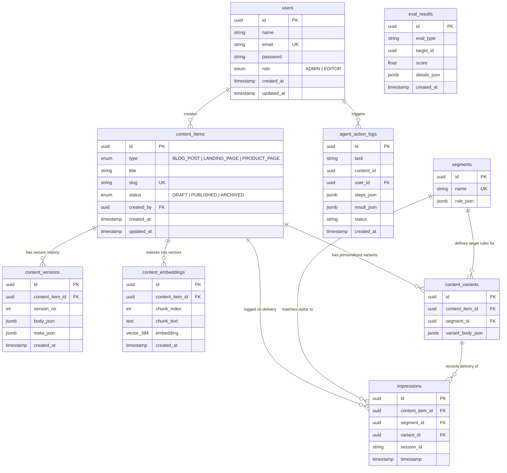

# Data Model & Schema Architecture

## Entity-Relationship Diagram



## Entity Details

### 1. `users`
Stores authenticated users (authors, editors, admins).
- `id`: UUID primary key.
- `role`: Role-based access control (`ADMIN` or `EDITOR`).
- `password`: Hashed with bcrypt (cost factor 10).

### 2. `content_items`
Core content registry representing a business document.
- `slug`: Unique human-readable URL identifier.
- `status`: Lifecycle state (`DRAFT`, `PUBLISHED`, `ARCHIVED`). Archiving acts as a soft-delete mechanism.

### 3. `content_versions`
Immutable version snapshots for audit trails and rollback capability.
- `version_no`: Increments per modification.
- `body_json`: Structured rich-text or component AST.
- `meta_json`: SEO title, description, keywords, OpenGraph properties.

### 4. `content_embeddings`
Dense vector representations supporting RAG semantic retrieval.
- `embedding`: Vector of 384 floating-point dimensions (`BAAI/bge-small-en-v1.5`).
- Indexed with PostgreSQL's IVFFlat cosine index:
  ```sql
  CREATE INDEX idx_content_embeddings_cosine 
  ON content_embeddings USING ivfflat (embedding vector_cosine_ops) 
  WITH (lists = 100);
  ```

### 5. `segments` & `content_variants`
Configurable rules and content variations for audience personalization.
- `rule_json`: Rule conditions such as `{"field": "isNewVisitor", "op": "eq", "value": true}`.
- `content_variants`: Overrides content body components for visitors matching the corresponding segment.

### 6. `agent_action_logs`
Audit log for autonomous AI agent executions.
- `steps_json`: Array recording every tool execution with input parameters, tool name, execution time, and raw output.
- `status`: `'completed'`, `'failed'`, or `'partial'`.

### 7. `impressions` & `eval_results`
Telemetry and analytics feedback loop.
- Records real-time page impressions to calculate personalization accuracy and audience reach.
- Evaluates retrieval precision@k and agent reliability benchmarks over time.
