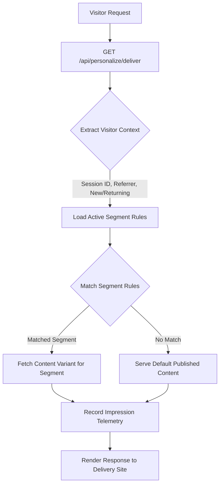

# Personalization Engine Architecture

## Overview

The Personalization Engine powers dynamic experience targeting on the Public Delivery Site without heavy machine learning latency. It mimics Adobe Target's rule evaluation logic, resolving the appropriate content variant per visitor in single-digit milliseconds.

## Resolution Workflow



## Rule Engine Syntax

Segment rules are represented as JSON ASTs:

```json
{
  "operator": "AND",
  "conditions": [
    {
      "field": "isNewVisitor",
      "operator": "eq",
      "value": true
    },
    {
      "field": "referrer",
      "operator": "contains",
      "value": "google"
    }
  ]
}
```

### Supported Operators
- `eq`: Exact equality.
- `neq`: Inequality.
- `contains`: Substring match (case-insensitive).
- `in`: Membership test in an array.
- `gt`, `gte`, `lt`, `lte`: Numeric threshold comparisons.

## Telemetry & Impression Attribution

Every delivered variant records an entry in `impressions`:
- `content_item_id`: Delivered item ID.
- `segment_id`: Matched segment (or null for default).
- `variant_id`: Resolved variant ID (or null for default).
- `session_id`: Unique visitor identifier.
- `timestamp`: UTC delivery time.

This telemetry directly feeds the evaluation pipeline to compute personalization correctness.
