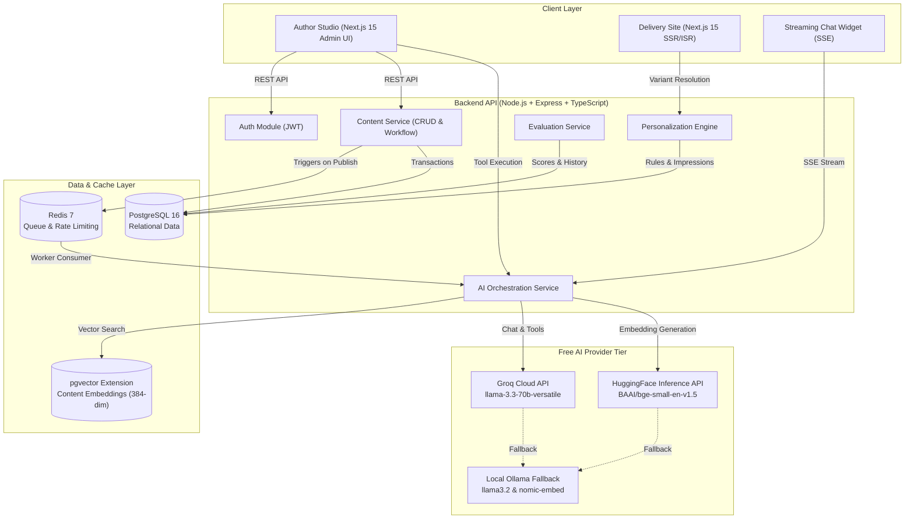

# System Overview Architecture

## Introduction

**ContentPilot AI** is an AI-Native Headless CMS featuring an intelligent Retrieval-Augmented Generation (RAG) assistant, automated publishing preparation via agentic tool calling, and segment-based real-time personalization. It maps directly to enterprise customer experience platforms like Adobe Experience Manager (AEM), Adobe Target, and Adobe Analytics.

## Architecture Diagram

## Component Responsibilities

### 1. Content Service
- **Domain**: Content creation, draft authoring, metadata management, version snapshotting, state machine (`DRAFT` → `PUBLISHED` → `ARCHIVED`).
- **Storage**: `content_items` and `content_versions` in PostgreSQL.
- **Publish Trigger**: Dispatches asynchronous indexing tasks to the Redis BullMQ queue upon publication.

### 2. Embedding & Indexing Pipeline
- **Decoupled execution**: Content publishing completes immediately without waiting for embedding generation.
- **Processing**: Breaks long-form content into overlapping chunks (~500 tokens, 50-token overlap).
- **Vector Storage**: Emits 384-dimensional dense vectors to PostgreSQL via `pgvector` with IVFFlat indexing.

### 3. AI Orchestration Service
- **Semantic Search**: Converts natural language queries into embeddings and queries pgvector using cosine distance (`<=>`).
- **RAG-Grounded Chat**: Injects top-k relevant chunks into a strict system prompt and streams token-by-token responses via Server-Sent Events (SSE) with source citations.
- **Agent Orchestrator**: Executes sequential tool workflows (`generate_meta_description`, `check_seo_score`, `suggest_audience_segment`) while recording full execution traces.

### 4. Personalization Engine
- **Visitor Segmentation**: Evaluates rule expressions (e.g., visitor type, traffic referrer, campaign parameters).
- **Variant Delivery**: Serves segment-tailored content variations with sub-millisecond overhead.
- **Impression Tracking**: Persists delivery telemetry into the `impressions` table for downstream analytics and personalization correctness evaluation.

### 5. Evaluation Harness
- Computes empirical metrics:
  - **Retrieval Precision@k / Recall@k** against ground-truth query benchmarks.
  - **Agent Completion Rate** based on successful execution of planned tool steps.
  - **Streaming Time-to-First-Token (TTFT)**.
