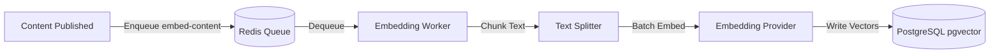

# Background Jobs & Queue Architecture

## BullMQ & Redis Integration

Content embedding and vector indexing occur asynchronously to prevent blocking the content editor during publishing.

## Queue Configuration

- **Queue Name**: `embedding-pipeline`
- **Concurrency**: 3 jobs concurrently.
- **Retry Strategy**: Exponential backoff with 3 retries (10s, 30s, 90s).
